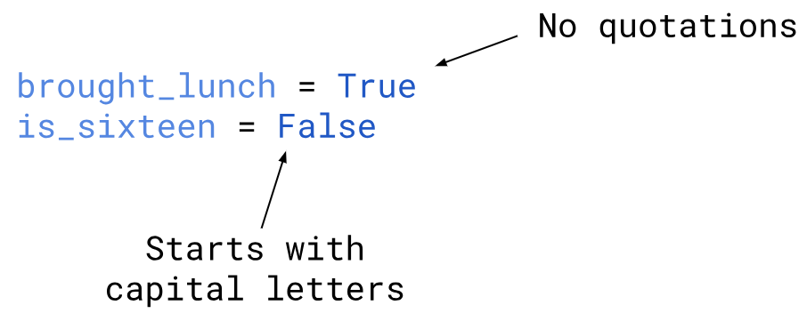

# 4.1 Booleans

A **boolean** is a value that can be either `true` or `false`.
You can think of it as an answer to a "yes" or "no" question. 

#### Some Real Life Examples:
Did you bring a lunch today? `Yes`<br>
Are you 16 yet? `No`

#### In Python:
```python
brought_lunch = True
is_sixteen = False
```

## Bool Data Type
In addition to the three data types we learned in Unit 3: `int`, `float`, and `str`, we now have one more data type: `bool` (Boolean) 
* `bool` only has **two** possible values: `True` or `False`
* `True` and `False` **must always start with a capital letter**
* It is **NOT** a string so there are NO QUOTATIONS around `True` and `False`

